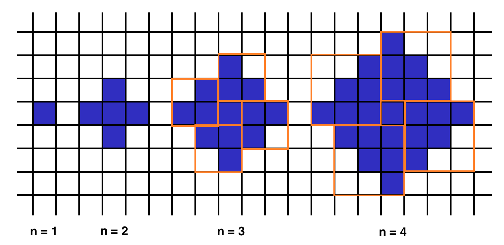

## 5. shapeArea
인자로 주어지는 n이 1 증가할 때 마다 겉 껍질이 한겹씩 늘어납니다.  
인지로 n이 주어졌을 때 전체 사각형의 갯수를 구해 리턴합니다



작성한 코드
``` Python
def shapeArea(n):
    if n == 1:
        return n
    else:
        return 4 * (n * (n - 1) // 2) + 1
```

위의 그림을 참조해주세요.  
제가 작성한 코드는 도형의 가장 가운데 블럭 1개를 기준으로 사분면의 형태로 나누어 계산합니다.  
나누어진 사분면은 모두 동일한 형태의 도형을 가지고 있고 그 형태는 `n - 1` `n - 2` .... `1` 의 순서로 블럭이 이어집니다.

각 사분면의 블럭수를 구하면 4를 곱해 전체 사분면의 블럭수를 구하고 처음 기준으로 잡았던 블럭 하나를 더해 총 갯수를 구합니다.


추천수 많았던 코드
``` Python
def shapeArea(n):
    return n**2 + (n-1)**2
```

위 코드는 제가 작성한 `4 * (n * (n - 1) // 2) + 1` 수식을 정리해 `n**2 + (n-1)**2` 형태로 변환합니다.